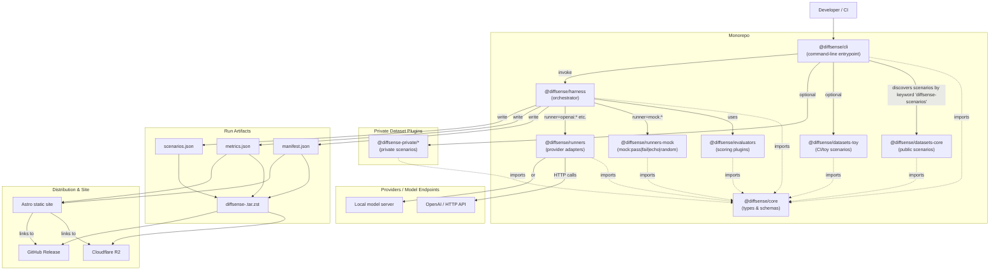

# DiffSense

DiffSense is a modular, open-source benchmark for evaluating large language models on real-world software engineering tasks. It provides a pluggable harness, reusable scoring plugins, and discoverable public and private scenario packs, making it easy to run consistent tests across different models and providers. Results can be published as static artifacts for full transparency, with optional private datasets supported for sensitive evaluations.

## Project Structure

DiffSense is organized as a set of modular npm workspace packages. Each package has a clear, single responsibility.

### **`@diffsense/core`** – Core Types & Schemas

- The **language** of the benchmark.
- Defines all shared type definitions, interfaces, and manifest/data schemas.
- Every other package imports from here so data shapes are consistent.

### **`@diffsense/harness`** – Orchestration Engine

- The **referee** of the benchmark. 
- Runs scenarios by:
  1. Calling a runner to execute the scenario against a model or tool.
  2. Passing the output through one or more evaluators to score it.
  3. Returning a result object with metrics.
- The harness does not care which model/provider you use—it just coordinates the process.

### **`@diffsense/evaluators`** – Scoring Plugins

- The **scorekeepers**.
- Each evaluator applies a specific metric to a model’s output (e.g., exact match, pass\@k, BLEU score, regex match).
- The harness can run multiple evaluators for a single scenario to collect richer metrics.

### **`@diffsense/runners`** – Model/Provider Adapters

- The **competitors’ interpreters**.
- Each runner knows how to send a scenario to a specific API or environment (OpenAI, local model server, mock runner, etc.) and return normalized output.
- The harness calls runners via a consistent interface.

### **`@diffsense/cli`** – Command-Line Interface

- The **tournament organizer**.
- User-facing tool that:
  - Parses command-line options (`--suite`, `--runner`, `--out`, etc.).
  - Selects scenarios from dataset packages.
  - Chooses the correct runner implementation.
  - Invokes the harness and writes results to disk.

### **Datasets** – Scenario Collections

- Packages that export arrays of `Scenario` objects.
- Examples:
  - **`@diffsense/datasets-core`** – main public scenario set.
  - **`@diffsense/datasets-toy`** – small, fast set for CI.
- Dataset packages are **discovered by keyword** (`"diffsense-scenarios"`) so the CLI can auto-load them.

### **Private Dataset Plugins**

Some scenarios may be private (e.g., licensed code, sensitive data). These live in **separate repos** published as private npm packages, e.g.:

```
@diffsense-private/datasets-codefixes
@diffsense-private/datasets-regressions
```

The CLI will load them if they are installed in the workspace.
CI installs private datasets from GitHub Packages when running the full benchmark.
Public releases include metrics and public-only raw data, but omit the private scenario content.

### Analogy

* **Core** → *the dictionary*
* **Harness** → *the referee*
* **Evaluators** → *the scorecards*
* **Runners** → *the competitors’ interpreters*
* **CLI** → *the tournament organizer handing out the scorecards*
* **Datasets** → *the challenges in the competition*
* **Private Datasets** → *secret challenge rounds*


